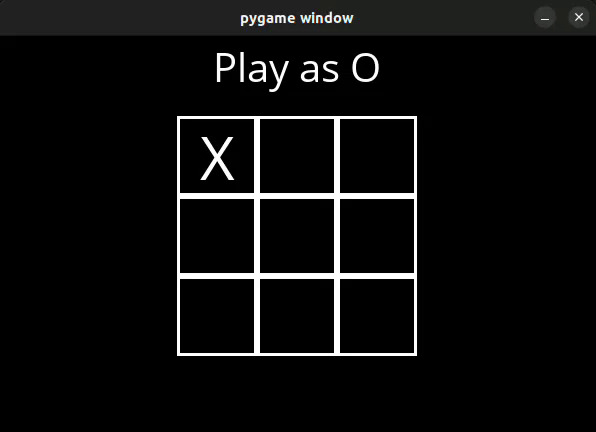

# TicTacToe 

This is an unbeatable TicTacToe game built as part of the CS50 AI Lab. The game leverages the Minimax algorithm, ensuring the AI opponent always plays optimally, making it impossible to defeat. Test your skills against this perfect AI and see if you can achieve a draw!

<p style="text-align: center;">
  
</p>


## Project Structure

- **assets/**: Contains assets for the UI elements of the game.
- **tictactoe.py**: Core file with the TicTacToe game logic and the Minimax algorithm implementation.
- **runner.py**: Main script to launch the game. Run this file to start playing.
- **requirements.txt**: Lists the required libraries for the project.

## Features

- **Unbeatable AI**: The AI uses the Minimax algorithm to evaluate every possible outcome and make the best possible move.
- **Optimal Strategy**: The AI is guaranteed to play perfectly, making a win impossible for the player.
- **Interactive UI**: The game includes a visually appealing, easy-to-navigate interface.

## How It Works

The AI's gameplay is powered by the **Minimax algorithm**, which enables it to:

1. **Explore All Moves**: The AI evaluates all potential moves and their outcomes, ensuring it plays optimally.
2. **Score Assignments**: Each end state (win, draw, or loss) is given a score, and the AI selects moves that maximize its chances of winning.
3. **Optimal Decision-Making**: By minimizing the player’s chances of winning and maximizing its own, the AI is guaranteed to be unbeatable.

## Installation

1. **Clone the repository**:
   ```bash
   git clone https://github.com/afsal4/TicTacToe.git
   cd tictactoe
   ```

2. **Install dependencies**:
    ```bash
    pip install -r requirements.txt
    ```

3. **To Run the game**:
    ```bash
    python runner.py
    ```

## How to Play

1. **Start the Game**: Run `python runner.py` in your terminal.
2. **Make Your Move**: Use the UI to place your move (X or O).
3. **Compete Against the AI**: Try to achieve a draw since the AI will always play optimally.

## Minimax Algorithm

The Minimax algorithm ensures that the AI always makes the best possible move by:

- **Recursive Evaluation**: Evaluating every potential board state up to the end of the game.
- **Optimal Play**: Selecting moves that lead to a win or draw, ensuring it cannot be defeated.
---

Give the game a try and challenge yourself against this unbeatable TicTacToe AI!